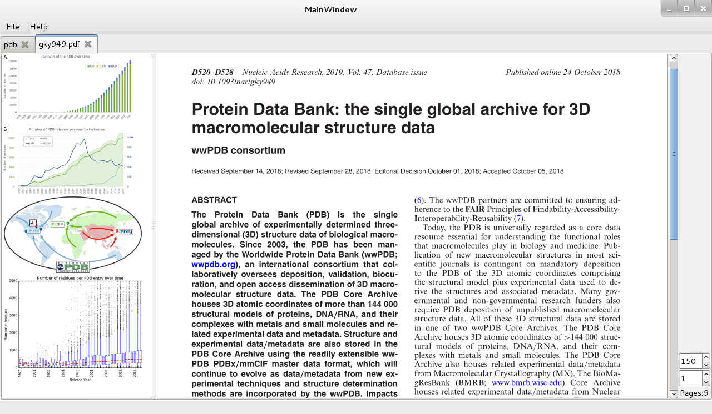

Dualword-PMC - [PubMed Central](http://www.ncbi.nlm.nih.gov/pmc/) browser and reader.

Features:
 - site-specific web browser with access to PubMed Central website
 - PDF files are automatically stored in SQLite database
 - offline tabbed PDF viewer
 - full-text search
 - image extraction
 - speed reading
 
License: GNU General Public License (Version 3)  
Source code: http://github.com/dualword/dualword-pmc/  

Third Party Software:
 - Qt License: LGPL v3
 - Xapian License: GNU General Public License
 - PDFium License: BSD 3-clause
 - SQLite License: Public Domain
  

   
